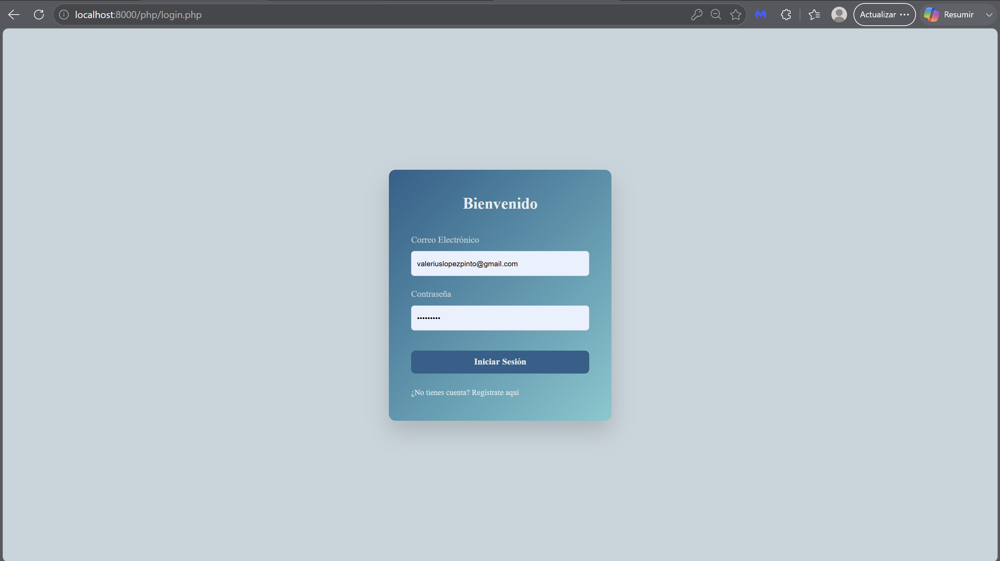
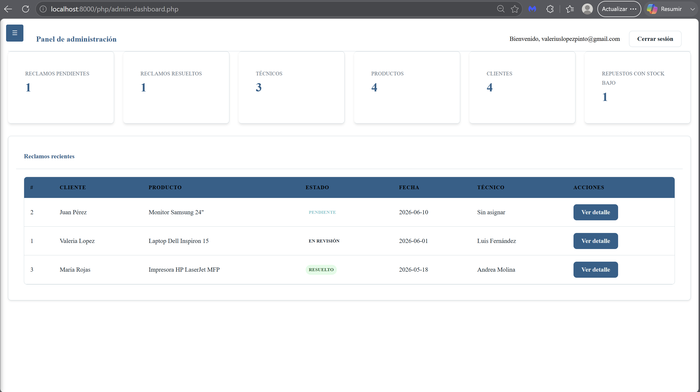
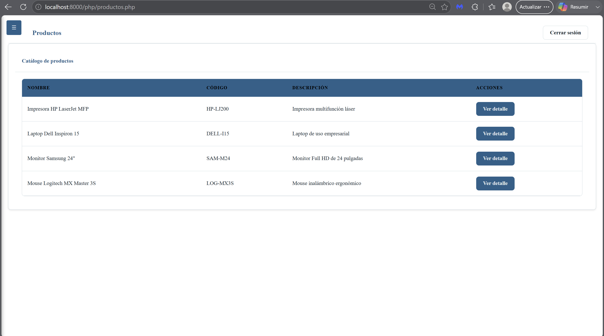
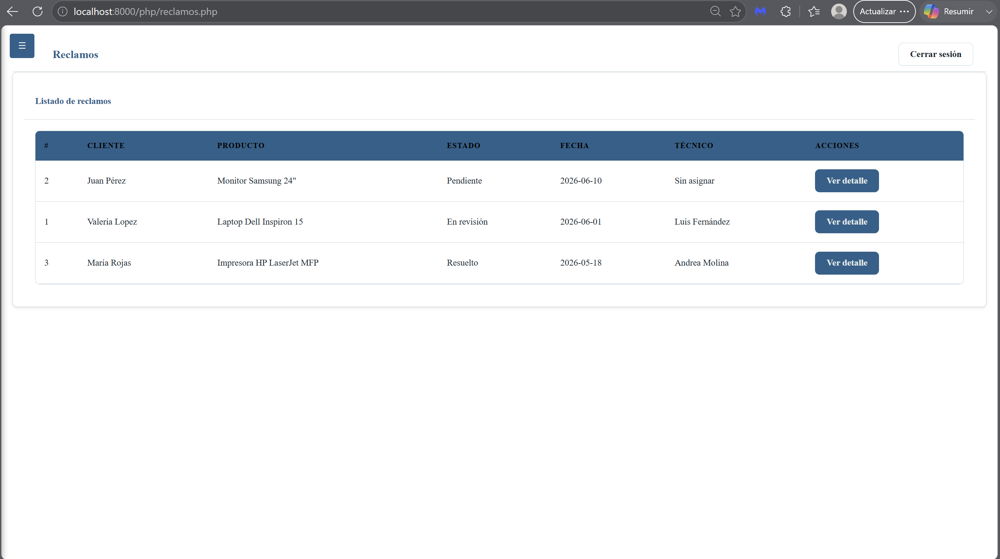

# Gestión Postventa

A web-based post-sales management system designed to manage customers, product registrations, warranty claims, technicians, and spare parts inventory through a centralized platform.

The application allows customers to register purchased products, submit warranty claims, and monitor their status, while administrators oversee the complete post-sales workflow, including claim assignment, technician management, inventory control, and warranty actions.

This project was developed as a portfolio application to demonstrate backend development, relational database design, authentication, session management, and software architecture using PHP and PostgreSQL.

---

## Features

### Customer Module

* User registration
* User authentication
* Product registration
* Warranty tracking
* Claim creation
* Claim status monitoring
* Product history management

### Administrator Module

* Dashboard overview
* Customer management
* Product catalog management
* Technician management
* Spare parts inventory management
* Product and spare part compatibility management
* Claim assignment
* Claim status management
* Warranty action tracking
* Spare parts usage registration

---

## Business Workflow

### Customer Process

1. Customer creates an account.
2. Customer registers a purchased product.
3. Customer submits a warranty claim.
4. Administrator reviews the claim.
5. A technician is assigned.
6. The claim is processed.
7. The claim is resolved or rejected.

### Claim Lifecycle

```text
Pending
    ↓
Assigned
    ↓
Under Review
    ↓
Resolved
```

Alternative path:

```text
Pending
    ↓
Rejected
```

---

## Technology Stack

### Frontend

* HTML5
* CSS3
* JavaScript

### Backend

* PHP

### Database

* PostgreSQL

### Version Control

* Git
* GitHub

---

## Database Design

### Main Entities

* usuario
* cliente
* tecnico
* producto_catalogo
* producto_cliente
* reclamo
* repuesto

### Relationship Entities

* producto_repuesto
* reclamo_repuesto

The database follows a normalized relational model to avoid duplicated information and maintain data consistency.

---

## Project Structure

```text
gestion-postventa/

assets/
css/
│
├── base/
├── components/
├── layouts/
└── pages/

database/
js/
php/
public/

README.md
.gitignore
```

---

## Screenshots

### Login

## Login



### Dashboard

## Dashboard



### Product Management

## Product Management



### Claims Management

## Product Management




---

## Installation

### Clone Repository

```bash
git clone https://github.com/YOUR_USERNAME/gestion-postventa.git
cd gestion-postventa
```

### Create Database

```sql
CREATE DATABASE postventa;
```

### Execute Schema

Run:

```text
database/schema.sql
```

to create all tables and relationships.

### Configure Environment Variables

Create a `.env` file using `.env.example`.

Example:

```env
DB_HOST=localhost
DB_PORT=5432
DB_NAME=postventa
DB_USER=postgres
DB_PASSWORD=your_password
```

### Start Application

Using PHP built-in server:

```bash
php -S localhost:8000
```

Open:

```text
http://localhost:8000
```

---

## Design Decisions

### Authentication Separation

Authentication data is stored in the `usuario` table, while customer information is stored separately in the `cliente` table.

### Product Separation

Products available for sale are stored in `producto_catalogo`, while customer-owned products are stored in `producto_cliente`.

### Inventory Management

Spare parts are managed independently and linked to products through compatibility relationships.

### Historical Integrity

The system prioritizes traceability and operational history. Business records such as claims and product registrations are intended to be preserved rather than permanently deleted. Status changes are preferred over data removal.

---
